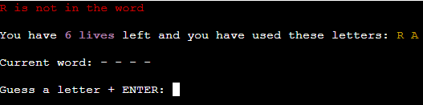

# [HANGMAN](https://hangman-ci-c8eaf2c13598.herokuapp.com)
## Overview
Hangman is a terminal based game that let the user test their word knowledge.

The user will compete against the computer to guess a randomly chosen word, one letter at a time. The amount of guesses are limited, so use the them with caution!

The user can choose between different word categories, and based on the word length, the amount of guesses will be set. 

This game was built as a project for the Diploma in Full Stack Software Development at Code Institute.

### Mock-up

## UX

I started out with a flowchart to determine the mapping of the app. After that I followed a tutorial to create the base structure, and adjusted the code to align with the ideas I had for the game.

Once the game was created, I wanted to add some color to the text, to make it a bit more interesting/easy to look at. I imported Colorama, and added the styling to the code.

## Features

### Existing Features

- **Welcome message and rules**

    - Greets the user and explains the rules

- **User input to start game**

    - Makes sure the user has time to read the message/rules, and has control over starting the game.

- **Category selection with simple terminal menu**

    - Multiple ways to select categories. Arrow keys or number input. 

- **Category selection feedback**

    - Lets user know which category was selected. 

- **Used letters and lives tracking**

    - User stays informed about which letters has been guessed, and of lives remaining.

- **Input feedback messages **

    - Offers feedback to the user that the input has been received, if the guess was correct or not, and if the letter has been used already.

- **Input alert-messages**

    - Informs the user about invalid input.

- **End game screen with "play again?" option**

    - Informs the user if they have won/lost and displays the word. Request to play again.

- **"Thank you for playing" message**

    - Lets the user know that the app is exiting.

### Future Features
- Add hints
    - Add functionality to receive word hints
- Add timer
    - Add functionality to limit response time
- Add more valid characters
    - Add functionality to use words with spaces and/or hyphens
- Add more categories

## Tools & Technologies Used

- [Python](https://www.python.org) used as the back-end programming language.
- [Git](https://git-scm.com) used for version control. (`git add`, `git commit`, `git push`)
- [GitHub](https://github.com) used for secure online code storage.
- [Gitpod](https://gitpod.io) used as a cloud-based IDE for development.
- [Heroku](https://www.heroku.com) used for hosting the deployed back-end site.
- [ChatGPT](https://chat.openai.com/) used for creating list for `food.py`.

## Data Model

### Flowchart

To follow best practice, a flowchart was created for the app's logic,
and mapped out before coding began using a free version of [Miro](https://www.miro.com/).

Below is the flowchart of the main process of this Python program. It shows the entire cycle of the program.

###  Functions

The primary functions used on this application are:

- `start_game()`
    - Runs/exits game
- `select_category()`
    - Menu for category selection
- `get_valid_word()`
    - Pulls a valid word for the user to guess, based on category selection
- `hangman()`
    - The game. Sets lives, word and asks for user input, with feedback
- `play_again()`
    - Requests user to play again
- `clear()`
    -  Clears the terminal

### Imports

I've used the following Python packages and/or external imported packages.

- `time`: used for adding time delays
- `os`: used for adding a `clear()` function
- `colorama`: used for including color in the terminal
- `random`: used to get a random choice from a list
- `string.ascii_uppercase`: used to create a set of alphabetical letters in uppercase for letters in word
- `simple_term_menu`: used for adding a simple terminal menu for category choices

## Testing

For all testing, please refer to the [TESTING.md](TESTING.md) file.

## Deployment

Code Institute has provided a [template](https://github.com/Code-Institute-Org/python-essentials-template) to display the terminal view of this backend application in a modern web browser.
This is to improve the accessibility of the project to others.

The live deployed application can be found deployed on [Heroku](https://hangman-ci-c8eaf2c13598.herokuapp.com).

### Heroku Deployment

This project uses [Heroku](https://www.heroku.com), a platform as a service (PaaS) that enables developers to build, run, and operate applications entirely in the cloud.

Deployment steps are as follows, after account setup:

- Select **New** in the top-right corner of your Heroku Dashboard, and select **Create new app** from the dropdown menu.
- Your app name must be unique, and then choose a region closest to you (EU or USA), and finally, select **Create App**.
- From the new app **Settings**, click **Reveal Config Vars**, and set the value of KEY to `PORT`, and the value to `8000` then select *add*.
- Further down, to support dependencies, select **Add Buildpack**.
- The order of the buildpacks is important, select `Python` first, then `Node.js` second. (if they are not in this order, you can drag them to rearrange them)

Heroku needs two additional files in order to deploy properly.

- requirements.txt
- Procfile

You can install this project's **requirements** (where applicable) using:

- `pip3 install -r requirements.txt`

If you have your own packages that have been installed, then the requirements file needs updated using:

- `pip3 freeze --local > requirements.txt`

The **Procfile** can be created with the following command:

- `echo web: node index.js > Procfile`

For Heroku deployment, follow these steps to connect your own GitHub repository to the newly created app:

Either:

- Select **Automatic Deployment** from the Heroku app.

Or:

- In the Terminal/CLI, connect to Heroku using this command: `heroku login -i`
- Set the remote for Heroku: `heroku git:remote -a app_name` (replace *app_name* with your app name)
- After performing the standard Git `add`, `commit`, and `push` to GitHub, you can now type:
	- `git push heroku main`

The frontend terminal should now be connected and deployed to Heroku!

### Local Deployment

This project can be cloned or forked in order to make a local copy on your own system.

For either method, you will need to install any applicable packages found within the *requirements.txt* file.

- `pip3 install -r requirements.txt`.

#### Cloning

You can clone the repository by following these steps:

1. Go to the [GitHub repository](https://github.com/DavidFB94/hangman) 
2. Locate the Code button above the list of files and click it 
3. Select if you prefer to clone using HTTPS, SSH, or GitHub CLI and click the copy button to copy the URL to your clipboard
4. Open Git Bash or Terminal
5. Change the current working directory to the one where you want the cloned directory
6. In your IDE Terminal, type the following command to clone my repository:
	- `git clone https://github.com/DavidFB94/hangman.git`
7. Press Enter to create your local clone.

Alternatively, if using Gitpod, you can click below to create your own workspace using this repository.

Please note that in order to directly open the project in Gitpod, you need to have the browser extension installed.
A tutorial on how to do that can be found [here](https://www.gitpod.io/docs/configure/user-settings/browser-extension).

#### Forking

By forking the GitHub Repository, we make a copy of the original repository on our GitHub account to view and/or make changes without affecting the original owner's repository.
You can fork this repository by using the following steps:

1. Log in to GitHub and locate the [GitHub Repository](https://github.com/DavidFB94/hangman)
2. At the top of the Repository (not top of page) just above the "Settings" Button on the menu, locate the "Fork" Button.
3. Once clicked, you should now have a copy of the original repository in your own GitHub account!

### Local VS Deployment

In the web terminal (heroku), the first menu option in the category selection has a white square to the left that doesn't exist in the local deployment.

## Credits

The base for the game was built using a tutorial (see Content below) for `hangman()` and `get_valid_word()`. After that I adjusted/added to those functions, added imports, and built on other features and functionalities.

### Content

| Source | Location | Notes |
| --- | --- | --- |
| [Markdown Builder](https://tim.2bn.dev/markdown-builder) | README and TESTING | tool to help generate the Markdown files |
| [StackOverflow](https://stackoverflow.com/questions/594273/how-to-pick-a-random-english-word-from-a-list) | `words.py` | mixed word list |
| [StackOverflow](https://stackoverflow.com/questions/2084508/clear-the-terminal-in-python) | `hangman.py` | how to create a clear terminal function |
| [GitHub Gist](https://gist.github.com/atduskgreg/3cf8ef48cb0d29cf151bedad81553a54) | `animals.py` | animals word list |
| [GitHub Gist](https://gist.github.com/kalinchernev/486393efcca01623b18d) | `countries.py` | countries word list |
| [Pypi](https://pypi.org/project/simple-term-menu/) | `hangman.py` | simple terminal menu import + basic menu code |
| [Pypi](https://pypi.org/project/colorama/) | `hangman.py` | terminal text color import |
| [YouTube](https://www.youtube.com/watch?v=u51Zjlnui4Y&ab_channel=TechWithTim) | `hangman.py` | how to use Colorama |
| [YouTube](https://youtu.be/8ext9G7xspg?list=PLpoNk5Bn13ymKrQzy6I_q6YQEnb0LDZAw&t=1466) | `hangman.py` + `words.py` | tutorial for creating a basic Hangman game + how to import from a word list |

### Media

| Source | Location | Type | Notes |
| --- | --- | --- | --- |
| [Pexels](https://www.pexels.com/sv-se/foto/tra-skylt-stapel-siffror-278887/) | entire site | image | favicon |

### Acknowledgements

- I would like to thank my Code Institute mentor, [Tim Nelson](https://github.com/TravelTimN) for their support throughout the development of this project.
- I would like to thank my wife Maria, for believing in me, and allowing me to make this transition into software development.
