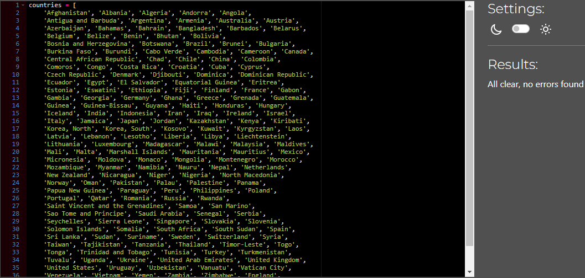
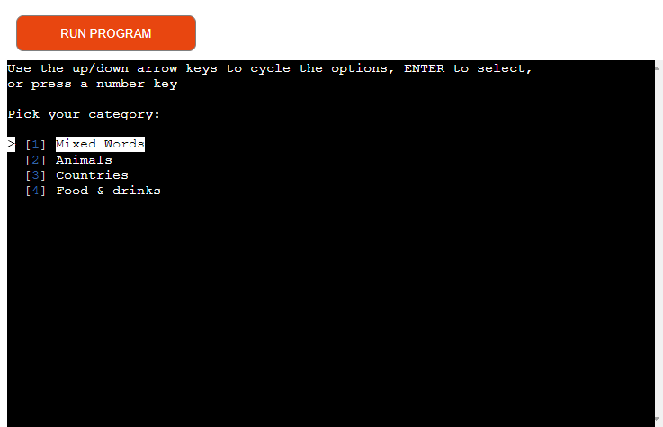
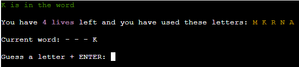
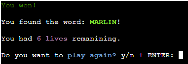

# Testing

Return back to the [README.md](README.md) file.

## Code Validation

### Python

I have used the recommended [PEP8 CI Python Linter](https://pep8ci.herokuapp.com) to validate all of my Python files.

| File | CI URL | Screenshot | Notes |
| --- | --- | --- | --- |
| hangman.py | [PEP8 CI](https://pep8ci.herokuapp.com/https://raw.githubusercontent.com/DavidFB94/hangman/main/hangman.py) |  | Pass: No Errors |
| words.py | [PEP8 CI](https://pep8ci.herokuapp.com/https://raw.githubusercontent.com/DavidFB94/hangman/main/words.py) |  | Pass: No Errors |
| food.py | [PEP8 CI](https://pep8ci.herokuapp.com/https://raw.githubusercontent.com/DavidFB94/hangman/main/food.py) |  | Pass: No Errors |
| animals.py | [PEP8 CI](https://pep8ci.herokuapp.com/https://raw.githubusercontent.com/DavidFB94/hangman/main/animals.py) |  | Pass: No Errors |
| countries.py | [PEP8 CI](https://pep8ci.herokuapp.com/https://raw.githubusercontent.com/DavidFB94/hangman/main/countries.py) |  | Pass: No Errors |

## Browser Compatibility

I've tested my deployed project on multiple browsers to check for compatibility issues.

| Browser | hangman.py | Notes |
| --- | --- | --- |
| Chrome |  | Works as expected |
| Firefox |  | Works as expected |
| Edge |  | Works as expected |

## Responsiveness

I've tested my deployed project on multiple devices to check for responsiveness issues.

| Device | hangman.py | Notes |
| --- | --- | --- |
| Mobile (DevTools) |  |  Works as expected. Not designed for mobile compatibility. |
| Tablet (DevTools) |  | Works as expected. Not designed for tablet compatibility. |
| Desktop |  | Works as expected |
| Sony Xperia 10 |  | Scaling starts to have issues. Not designed for mobile compatibility. |

## Lighthouse Audit

I've tested my deployed project using the Lighthouse Audit tool to check for any major issues.

| Page | Mobile | Desktop | Notes |
| --- | --- | --- | --- |
| hangman.py |  |  | Some minor warnings |

## Defensive Programming

Defensive programming was manually tested with the below user acceptance testing (CTRL + C always interrupts the terminal):

| Page | Expectation | Test | Result | Fix | Screenshot |
| --- | --- | --- | --- | --- | --- |
| `hangman.py` | | | | | |
| | Game is expected to display welcome message + rules when run | Tested the feature by running game | The game ran, and message + rules were displayed | Test concluded and passed |  |
| | Game is expected to start when the user press ENTER (only) | Tested the feature by trying inputs (alphabetical input, multiple characters, numbers, special characters, keypress combinations) | The game started only when ENTER was pressed | Test concluded and passed |  |
| | Category is expected to be selected only when the user selects with up/down arrow keys + ENTER or single number input | Tested the feature by trying inputs (alphabetical input, numbers, special characters, keypress combinations) | The category was selected when up/down + ENTER or single number input was pressed. Pressing Q, ESC or CTRL + C causes TypeErrors. PG UP hovers the first category, PG DN hovers the last. | Test concluded. Known bugs. See "Unfixed Bugs" section | 
 |
| | Tracking is expected to update the lives + used letters after the user has guessed a letter | Tested the feature by guessing a letter, make a correct guess to reduce lives, and guess a correct letter to have the lives stays the same | The feature behaved as expected | Test concluded and passed |  |
| | Input feedback message is expected to display colored text feedback based on correct/incorrect guess and if a letter has already been used | Tested the feature by guessing a letter, guessing an already used letter, make a correct guess to see green text, and guess an incorrect letter to see red text | The feature behaved as expected | Test concluded and passed |  |
| | Input alert-message is expected to display colored text feedback when user uses invalid input | Tested the feature by using invalid input (multiple characters, numbers, special characters, keypress combinations) | The feature behaved as expected | Test concluded and passed | 
 |
| | End game screen is expected to inform the user about win/loss, display the chosen word, how many lives were remaining (if the user won), and request the user to play again. If the user selects to play again, take the user to the start game screen. If user selects to not play again, take user to exiting game screen. The feature will also display colored text feedback when invalid input is used | Tested the feature by guessing until the lives ran out, and guessing until I found the word with lives remaining. Selected to play again, and to not play again. Tried different inputs to test feedback (multiple characters, numbers, special characters, keypress combinations) | The feature behaved as expected | Test concluded and passed | 
 |
| | Thank you for playing message is expected to display a message if the user choses to not play again | Tested the feature by finishing the game, and choosing to not play again | The feature behaved as expected | Test concluded and passed |  |

## Bugs

- Occasionally, the word that was selected did not match the selected category. 

    

    - I used print statements to locate the bug. When words containing a "space" or "-" was selected, the function defaulted back to `words-py`.  To fix this, I had to replace "words" with "category" as the argument in the get_valid_word() while-loop.

- Python `E741` (ambiguous variable name)

    

    - To fix this, I changed the variable name.

- Python `E501` line too long (108 > 79 characters)

    

    - There were several of these errors. Most of them were re-formatted. To fix line 238, I added # noqa.

## Unfixed Bugs

- When in the terminal menu, hitting ESC and Q will cause a TypeError.

   

    - Could not find fix.
 
- CTRL + C will cause an KeyboardInterrupt (in category selecting it causes TypeError).

    

    - Could not find fix.

- When using the web terminal in Heroku, the first menu option has a white square to the left.

    

    - Could not find fix.

